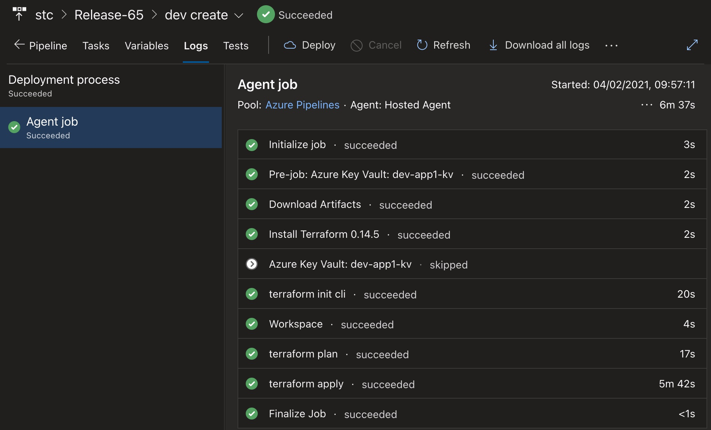

# Deploy Solution Features
- Deploys to an empty cloud subscription with no existing infrastructure in place
- Start from a cloned git repo
- Pre-requisites documented in the following section
- Deploy code contained within this GitHub repository
- Fully automated deploy with terraform
- Entirely infrastructure as code
- Auto scaling and highly available frontend natively with Azure App Service
- Highly available Database natively with Azure Database for PostgreSQL
- Secret stored in Azure Key Vault
- App connects with Database through private network

# Pre requisites for your deployment solution
- terraform init -backend-config=backend-config.txt
- as a security feature, keyvault soft delete is now enabled by default on azure. to remove keyvault use script: tfaz0-be-local/rm-kv.sh
    - https://docs.microsoft.com/en-us/azure/key-vault/general/soft-delete-change
- variables
    - a single terraform input variable is expected - declare as an environment variable or be prompted for a value.  
        - export TF_VAR_dbpassword=123456789qwertyuipz_
    - all other variables have defaults
- expect azcli installed
    - https://docs.microsoft.com/en-us/cli/azure/install-azure-cli

# High level architectural overview of  deployment 

Deploy is in three parts. 

- Deploy terraform backend on azure storage
  - directory: tfaz0-be-local - Terraform files
- Deploy keyvault and populate with dbpasswd
  - directory: tfaz1-kv-local - Terraform files
- Deploy solution 
  - directory: tfaz2-pipeline - Terraform files and this document
  - directory: tfaz2-pipeline/azdevops - Azure DevOps Release Pipeline Yaml

# Process instructions for provisioning
## 1. Deploy terraform backend on azure storage
- Run from local to output backend-config.txt for terraform backend init during stage 3. Deploy solution 
    - storage_account_name, container_name, key(file:terraform.tfstate), sas_token
- Possible future developments: 
    - Pipeline to create terraform backend storage and store reference parameter in e.g. consul
- Commands: 

```bash
cd tfaz0-be-local
terraform init
terraform plan -out tfplan
terraform apply tfplan
```

## 2. Deploy keyvault and populate with dbpasswd
- Run from local as dbpasswd begins as a local system terraform (environment) variable. 
- Sample workspace values: dev|accp|prod. optional as if unspecified will be "default"
- Possible future developments: 
    - Pipeline creates random password and stores password in new keyvault
- Commands: 

```bash
cd tfaz1-kv-local
./workspacetest.sh dev
terraform init
terraform plan -out tfplan
terraform apply tfplan
```
## 3. Deploy solution 
- Can be invoked from local or pipeline. Do NOT run local & pipeline concurrently or state will lock. To unlock:
  - terraform force-unlock LOCKID
- terraform state backend on azure storage. 
- Sample workspace values: "dev|accp|prod". Where unspecified will be "default". 
- Commands: 
```bash
cd tfaz2-pipeline
cp ../tfaz0-be-local/backend-config.txt .
./workspacetest.sh dev (optional)
terraform init -backend-config=backend-config.txt
terraform plan -out tfplan
terraform apply tfplan
```

- CLI Sample Output:

```bash
dbname = "default-app1-70078"
dbuser = "login@default-app1-70078"
default_site_hostname = "http://app1-70078.azurewebsites.net"
kv_dbpassword_id = "@Microsoft.KeyVault(SecretUri=https://default-app1-kv.vault.azure.net/secrets/dbpassword/1f9476b9a9ab4eba8f87e14af8907bb3)"
```
Azure DevOps Screenshot



Notes
- Azure DevOps started to fail db.tf null_resource.db_seed for --entrypoint on servian/techchallengeapp. This was needed for "updatedb -s". Workaround is to publish the following container to brian2nw/stc
ENTRYPOINT [ "./TechChallengeApp","updatedb","-s"]

# Architecture

## Terraform

- Workspace feature for multiple environment
  - https://www.terraform.io/docs/language/state/workspaces.html
- Functionality separated into separate files
  - app, backend, db, keyvault, providers, shared, variables, vnet

## Secrets

- dbpassword is only secret in use. It is stored in Azure KeyVault. 
- Azure App Service is provided minimal 'get' privileges only

## Network

- For security App connects to Database through Azure VNET
- Both App and Database connect to Int (Integration) subnet
  - Service Endpoint - Microsoft.Sql 
  - Subnet Delegation - Microsoft.Web/serverFarms
- Possible future developments: 
  - Network Security Group rules to limit traffic. Not needed at the current time as only App and Database use VNET. 

## Database
- Azure Database for PostgreSQL servers is natively Highly Available
- SSL enforce status is disabled as App does not support it. 
- Smallest General Purpose Tier Database size chosen. Basic Tier does not support required VNET service endpoint. 
  - GP_S_Gen5_1 - Single server (includes HA) GeneralPurpose, Gen5, 2 vCores, 5 GB Storage $247 / month
  - https://docs.microsoft.com/en-us/azure/azure-sql/database/resource-limits-vcore-single-databases
- Geo rudundant backup option chosen. 
- Though marginally cheaper Azure Database for PostgreSQL Flexible Server was not chosen as requires Private Link and is in preview. Private Link would have increased complexity & incurred a usage cost. 
  - General Purpose, HA, locally redundant, 2 availability zones, private access, D2s_v3, 2 vCores, 8 GiB RAM, 32 GiB storage  $229 / month
- Possible future developments: 
  - Update Go app to support SSL connection to database
- Terraform local-exec post deploy step to popuate database 
  - '-s' option required for Azure Database for PostgreSQL PaaS
  - leverages script on volume as otherwise app did not parse cli correctly 
  - ``` ./TechChallengeApp updatedb -s ```

## App Service

- Application run using pre-built container from dockerhub 
  - servian/techchallengeapp:latest
- Environment Variables inherited from Application Settings Configuration
  - Exception: VTT_DBPASSWORD redirects to Azure Keyvault for enhanced security
- App has System Assigned User Identity for Access Role Assign in Keyvault
  - https://docs.microsoft.com/en-us/azure/app-service/app-service-key-vault-references
- App Service connects to Integration subnet
  - Subnet Delegation - Microsoft.Web/serverFarms 
  - https://docs.microsoft.com/en-us/azure/app-service/web-sites-integrate-with-vnet
- Scaling
  - Increase count on CPU > 70% for 5 minutes
  - Decrease count on CPU < 30% for 20 minutes
- Health check implemented at API endpoint /healthcheck/
- Terraform local-exec post deploy step to curl website for immediate function with 120 second timeout

### 

